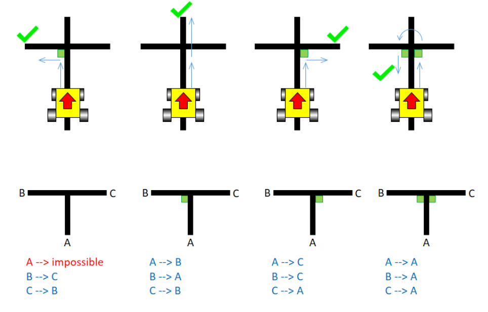
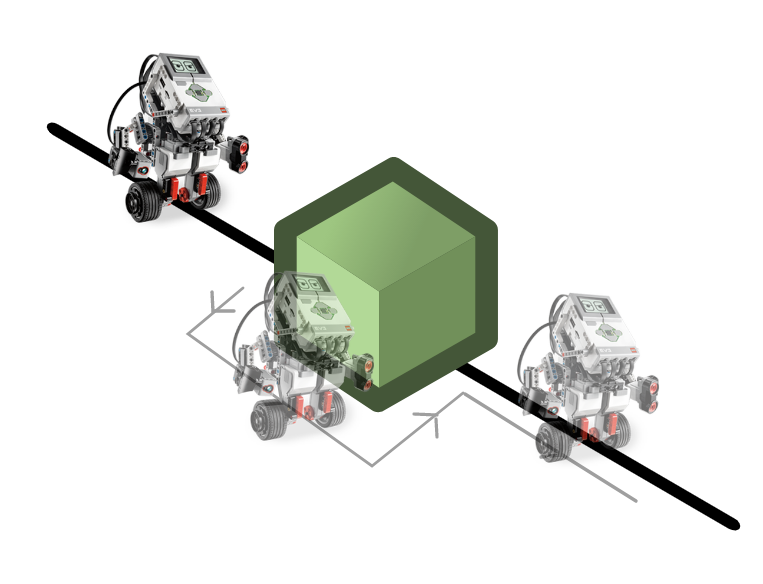
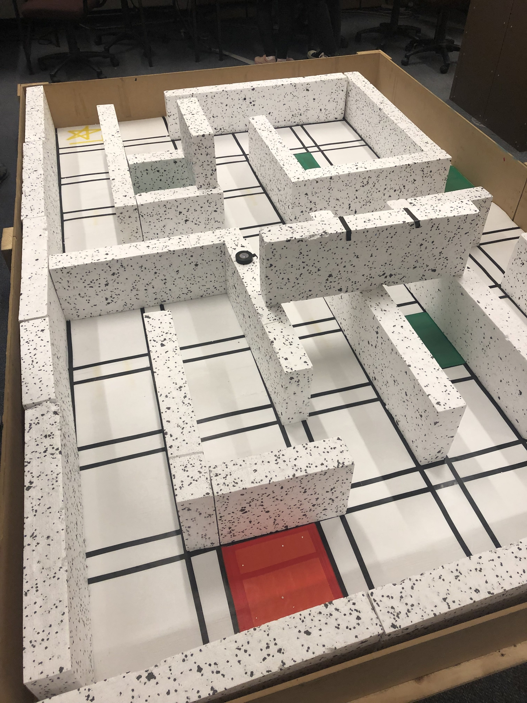

# Robotic EV3 Projects

Both the assisted and complete maze-solver programs (written in Java and [leJOS](www.lejos.org)) are used to guide a [Lego Mindstorms EV3](https://education.lego.com/en-gb/product/mindstorms-ev3) through a maze system.

---

Both programs were designed and implemented as a group. Our group consisted of Jake Pierrepont, Jonathan Caines and me (all First Years at the time). Permission for publication has been ensured prior to uploading and all files have authors assigned to them that were responsible for the specific code segment.

---

## Assisted Maze Solver

The assisted maze solver program was the first (marked) assignment we had using the robot.
The maze was just a grid of **black tape-lines** where the robot should follow the line and every possible occurance of intersection with **green tape as additional information** had a specified action so at the end the robot should have traversed the maze. Additionally if it detects an **object on the path** it should move around it and continue.

We used light and IR sensors to detect the lines (and their color) and objects respectively.

Our specifications were:

.

.

## Complete Maze Solver

The complete maze solver is a vastly more complicated task. It was supposed to mimic an emergency robot mapping and traversing terrain to find an accident site and find the shortest path for medical help.

The specification file for the assignment was large but can be mostly summarized down to:

**General information:**

- The maze is only known after submission and can therefore not be hardcoded
- Green tiles must be handled as inpassable terrain (similar to walls)
- The tile in the corner with yellow tape is the starting point
- The red tile is the goal tile

**The Program:**

- Start
- Find the end tile
- Explore until the shortest path from end tile to start tile is found
- Move to the end tile
- Go back the shortest path to the start
- Terminate

**Additional specifications:**

- Travers the maze as fast as possible
- Display the map in some output (e.g. on the robot in text or over bluetooth as command output)
- Robot must at any point be able to travers back to the start of the maze

### The map

---

### Our solution

#### The robot

#### Our live-updating map

Apart from meeting the general assignment goals we additionally implemented

- an A* search algorithm and prediction model to efficiently find the fastest route if the program was used on a large-scale maze.
- a live-updating map running on a GUI on any bluetooth-paired device (here MacBook). Bluetooth pairing is automated. The GUI additionally displays the stack to return back to the starting tile in case of a call-back (green) as well as a predicted shortest route back (yellow) that will be reevaluated after every tile to check for validity.
- parallel scanning of the terrain while driving to significantly increase speed and map-update sending while robot rolls but stopped motors.

We also mounted both an Ultrasonic and Infrared sensor on a motor to rotate them and scan all 3 sides (left, front, right) while driving and use IR for higher precision low-distance measurements and US for lower precision measurement verification.
